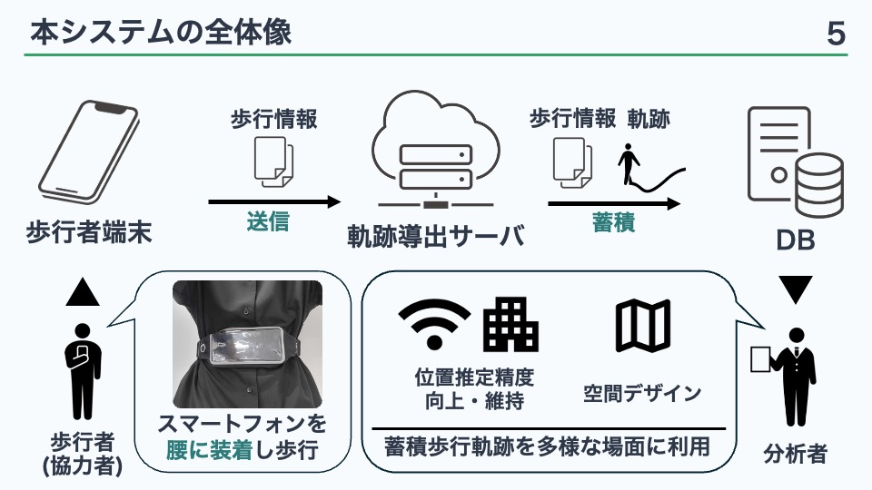

# 研究概要
## 背景
歩行軌跡は屋内測位の精度維持・向上や行動分析に活用できる. 先行研究では、 図1に示すような特別な端末を用意せずスマートフォンのセンサを利用して, センサデータと同時に分析結果の一つである歩行軌跡を蓄積するモバイルクラウドセンシングシステムが行われている。

図1: 歩行軌跡を蓄積するモバイルクラウドセンシングシステムの全体像

そこで、本研究では歩行軌跡からフロアの使われ方を分析するシステムを開発する.
## 目的・アプローチ
### 目的
- 歩行軌跡からフロアの使われ方を分析する

### アプローチ
- 歩行軌跡可視化システムを開発・分析

## 現在行っている研究
歩行軌跡可視化システムを作るためのAPIの開発

## API
特定の建物・フロアに蓄積された歩行軌跡データ（推定軌跡および正解軌跡）を取得する
例.大学内の1号館5階の情報をリクエストすると、その建物の歩行軌跡データを取得する

